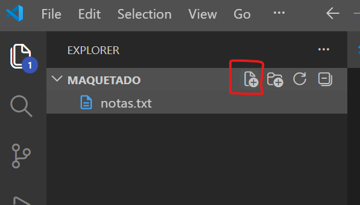

# Pasos

1. Crear una carpeta
2. Abrir la carpeta con VS Code
3. Crear un archivo index.html



## Etiquetas para textos


``` html
<h1> Títulos </h1>
```
 
``` html
<p> textos</p> 
```
``` html
<strong>enfasís semántico </strong> 
```